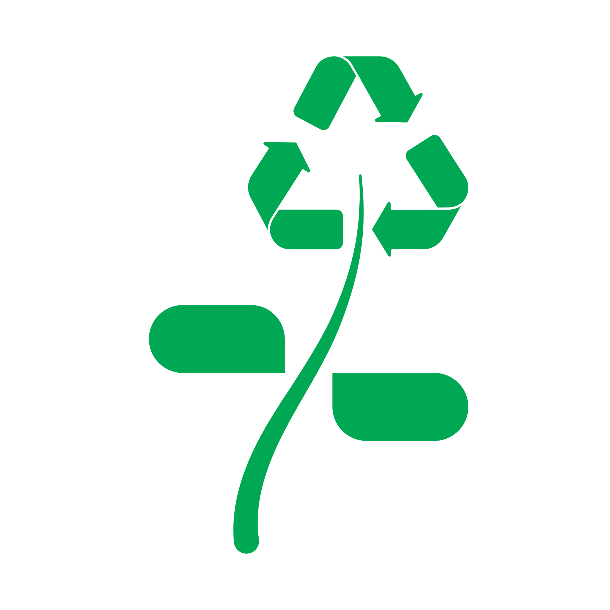

<div align="center">
    <a href="https://flutter.dev/"></a>
    <a href="https://deepmind.google/technologies/gemini/"></a>
</div>

<br />
<div align="center">
    

  <h1 align="center">BinChat</h1>

  <p align="center">
    Talk Green, Live Clean
    <br>
  </p>
</div>

<div align="center">
    <a href=#introduction>Introduction</a>
    •
    <a href=#features>Features</a>
    •
    <a href=#demo >Demo</a>
    •
    <a href=#installation>Installation</a>
    •
    <a href=#future-works >Future Works</a>
    •
    <a href=#contributing >Contributing</a>
    •
    <a href=#quote >Quote</a>
</div>
<br>


## Introduction
BinChat is your ultimate companion for all things recycling. Designed to inspire and guide you through eco-friendly practices, BinChat leverages the power of Gemini to let you chat, interact, upload photos for personalized suggestions. Access a wealth of valuable tips and insights on ecology, product upcycling, waste management, and more. Dive into the recycling world with BinChat and make a positive impact on the environment! :recycle: :seedling:

### Vision Statement
BinChat envisions a world where sustainable living is effortlessly integrated into everyday life. We aspire to be the leading digital platform that transforms recycling and waste management into intuitive, engaging experiences. Our goal is to harness cutting-edge technology to empower individuals and communities with the knowledge and tools needed to make environmentally conscious decisions. By fostering a culture of sustainability and innovation, BinChat seeks to drive global change, inspiring a cleaner, greener future where every action contributes to the well-being of our planet, with Gemini at your side. :recycle: :earth_americas:

### About This Project
This app has been developed from scratch for the [Gemini API Developer Competition](https://ai.google.dev/competition) 2024 during my free time... and this is my first app written in Flutter!

There are many enhancements and fixes that can be applied to BinChat. If you find it interesting, please <a href=#contributing >contribute</a>!


## Features

Explore the functionalities of BinChat! 

### Key Features

#### 1. **Natural Language and Image Interaction**
   - **Powered by Gemini:** The app uses Gemini models to handle user interactions. Whether users input text or upload an image, the model delivers accurate and context-sensitive advice on how to dispose of or repurpose waste items.
   - **Smooth and Contextual Responses:** To ensure that the responses are relevant and on point, the system is pre-configured with instructions that set the general context of conversations, ensuring that all guidance is centered around responsible recycling and creative reuse.

#### 2. **Tip Generation**
   - **Contextual Tips:** The app can generate insightful recycling tips. Using specific instructions provided to the Gemini model, it delivers concise and engaging suggestions that inspire users to adopt better recycling habits.

#### 3. **Suggestion Chips**
   - **Conversation Starters:** To help users kickstart their interaction, the app generates a list of suggestion chips—brief prompts that encourage exploration of recycling topics. These are dynamically created in JSON format, ensuring variety and creativity in the suggestions.

#### 4. **Chat History Titles**
   - **Concise Chat Summaries:** Each conversation can be saved, and the app automatically generates a succinct, four-word title that encapsulates the core of the discussion. This feature aids users in quickly identifying and revisiting past conversations.

### Technical Details

#### **System Instructions**
The app relies on system instructions that define the behavior and tone of the responses generated by Gemini:

   - **General Chat Context:**
     ```text
     "The general context needs to be about recycling in a correct way a waste. The user can provide a text or an image and you have to provide two answers: how to trash it in the best way possible and how the user can re-use the product to give it a second-life. Go straightforward to the point that the user wants. Be eco-friendly and answer in a friendly way."
     ```

   - **Suggestion Chips:**
     ```text
     "Generate a bulleted list of 4 items with suggestions of three-four words to start a conversation with a bot about how to recycle or curiosity about recycling, waste, ecology. Be creative."
     ```

   - **Tips Generation:**
     ```text
     "Complete the phrase, without repeating my words, in a context where the user wants to know secrets and curiosity about recycling, like giving it tips."
     ```

   - **Chat Title Generation:**
     ```text
     "Abstract from this conversation a title of 4 words or fewer: Be as concise as possible without losing the context of the conversation. Your goal is to extract the key point of the conversation. Example: 'You have to write a proposal research' is abstracted to 'Write research proposal,' which captures the main action required. The conversation: '$conversationText'"
     ```

#### **Model Configuration**
   - **Default Model:** The app uses `gemini-1.5-flash-latest` as the default model, which is freely accessible.
   - **Conversation Style:** Users can choose the style of conversation with different temperature settings:
     - Creative (`temperature=0.0`)
     - Balanced (`temperature=1.0`)
     - Precise (`temperature=2.0`)

#### **Safety Settings**
   - **High Safety Standards:** The app's safety settings are configured to block harassment, hate speech, and sexually explicit content. While this ensures a secure environment, some legitimate responses might be denied due to these strict safety measures.


### Features Overview

> [!NOTE]
> Some UI elements are currently mockups or contain placeholder data to demonstrate their intended functionality.

| **Tab**     | **Available**                                                                                            | **Not Available**                      |
|-------------|----------------------------------------------------------------------------------------------------------|----------------------------------------|
| **Home**    | - News reader<br>- Link and PDFs manager<br>- PDF viewer<br>- Nearest facility                                                 | - Schedule a pickup<br>- Notifications |
| **Explore** | - (Currently no available features)                                                                      | - Feed<br>- New post<br>- Search               |
| **Chat**    | - Chat with Gemini using text or photo<br>- Copy to clipboard by long pressing on a message<br>- Start a new conversation<br>- Suggestion cards to start a chat<br>- Save and load chat history | - Search a chat in history<br>- Display images correctly when resuming a chat|
| **Learn**   | - Generate new tips<br>- Bookmarks<br>- Start a chat with the current tip                                 | - Share the post on the feed           |
| **Settings**| - Conversation style<br>- Erase user data<br>- News keyword selection                                     | - User profile<br>- Notifications toggle |


## Demo

## Installation
To install and test BinChat, follow these steps:

1. Gemini API Key Requirement: You need a Gemini API key to use the app. The easiest way to obtain one is via [Google AI Studio ](https://ai.google.dev/aistudio)
> [!IMPORTANT]
> If you live in Europe, you must link a billed account to access the free API. For more details, refer to this [link](https://ai.google.dev/gemini-api/docs/billing?_gl=1*1wl4f17*_ga*MTgzOTg4MzAwNS4xNzIwNTM0NzEw*_ga_P1DBVKWT6V*MTcyMzA1OTE3MC4yMS4xLjE3MjMwNTkzODQuMC4wLjEzMjE1ODQ1MA..#is-Gemini-free-in-EEA-UK-CH). The Gemini 1.5 Flash model (the one used in this app) is free of charge

2. For news updates, I obtain the API key from [NewsAPI](https://newsapi.org/) , which is available free of charge

3. Ensure you have Flutter and Dart SDK installed on your development environment. For more information, refer to the official Flutter documentation: [Flutter Installation](https://flutter.dev/docs/get-started/install)

4. Clone the repository to your local machine:
   ```
   git clone https://github.com/laitifranz/BinChat.git
   ```

5. Change your working directory to the cloned repository:
   ```
   cd BinChat
   ```

6. Fetch the dependencies by running the following command:
   ```
   flutter pub get
   ```

7. Connect your mobile device or start an emulator

8. Use the following command to launch the app, replacing ``$YOUR_GEMINI_API_KEY`` and ``$YOUR_NEWS_API_KEY`` with your actual API keys:
   ```
   flutter run --dart-define=API_KEY_GEMINI=$YOUR_GEMINI_API_KEY --dart-define=API_KEY_NEWS=$YOUR_NEWS_API_KEY
   ```
    or create ``api_keys.json`` file inside e.g. ``lib`` folder
    ```
    flutter run --dart-define-from-file lib/api_keys.json
    ```

9. The application will be installed on your device/emulator

> Tested on Flutter 3.22.2 using VSCode, on an Android emulator simulating a medium-sized phone running Android VanillaIceCream Preview

## Future Works
- [ ] Implement RAG-like system to extract and utilize information from PDFs or websites saved in the manager ([possible hint](https://stackoverflow.com/questions/78316397/access-pdf-files-using-the-gemini-api))
- [ ] Set up a robust database to manage user data, including integration with Firebase for cloud-based data management
- [ ] Implement a parser to detect and handle potential personal data when users post content on social feed, including both text and images
- [ ] Work on implementing features currently listed as "Not Available" to enhance the app’s functionality

## Contributing
Contributions to BinChat are welcome! If you'd like to contribute, please follow these guidelines:

1. **Fork the repository on GitHub**.
   Navigate to the BinChat repository and click the "Fork" button to create a copy of the repository on your GitHub account.

2. **Create a new branch**.
   Create a new branch with a descriptive name for your feature or bug fix:
   ```bash
   git checkout -b feature/your-feature-name
   ```
3. **Make your changes**.
    Implement your changes and ensure they are tested on at least one emulator or physical device.

4. **Commit your changes**.
    Commit your changes with a clear and concise commit message:
    ```bash
    git commit -m "Description of your changes"
    ```

5. **Push to your forked repository**.
    Push your changes to your forked repository:

    ```bash
    git push origin feature/your-feature-name
    ```
    
6. **Submit a pull request**.
Go to the original BinChat repository and submit a pull request. Please detail the changes you made and explain their purpose.

## Credits
App icon adapted from an asset by Freepik.

## Quote
_Code your dreams into reality, one widget at a time. Your journey with Flutter is just the beginning of an incredible app-venture!_
